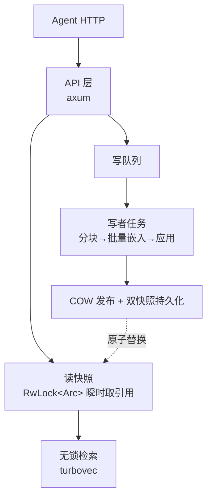

# PR：JuanNiang-RAG-Service —— tag↔向量 检索服务完整实现

> 分支：`main`（已与 `origin/main` 同步，10 个提交）
> 状态：✅ 编译零警告 · 25 项测试通过 · API 全流程实测通过

## 概述

为 JuanNiang-Neo 实现独立的 RAG 检索服务：**tag（uuid）↔ 向量** 的存储与检索，供主 Agent 通过 HTTP 调用。原始文档与 uuid 由 Agent 保管，本服务只做向量化、检索与删除。

**技术栈**：Rust（edition 2024）· bge-small-zh-v1.5 Q8_0（llama.cpp 进程内推理）· turbovec 0.9（TurboQuant 量化索引）· axum 0.8。

## 背景与动机

- Agent 端已有完整文档库（uuid ↔ 全文），需要一个**零外部依赖**的向量检索层：无数据库、无独立推理服务、单进程可部署
- 长文本**不允许在 Agent 端拆分**，分块必须发生在服务端内部且对 Agent 无感知
- 查询与写入**互不阻塞**（Agent 持续检索期间可安全批量入库）
- 批量写入需要专门优化（批量推理 + 合并发布）

## 变更范围（10 个提交）

| 提交 | 内容 |
|---|---|
| `b91cdc5` | 基础模块：配置、统一错误链、embedding 专属线程（前缀/归一化/批量/截断/预热） |
| `b3af581` | 服务端透明分块（260 字符/块、50 重叠、句子边界优先） |
| `a58caf1` | IdMapIndex 封装（检索/删除/COW 序列化往返拷贝） |
| `d5c65e7` | tag↔块向量 1:N 存储、双快照原子持久化、损坏自愈重建 |
| `893e63c` | 写队列 + COW 快照发布（读写互不阻塞）、批量合并发布 |
| `04c5520` | HTTP API（upsert/批量/检索/删除/健康检查）+ 按 tag 聚合检索 |
| `d621a47` | 查询 LRU 缓存、端到端测试、README、分阶段提交脚本 |
| `6f50fbb` | 正式 API 文档（docs/API.md） |
| `ee2aeca` | `/info` 端点（模型状态/进程内存/向量规模） |

## 架构与设计要点



1. **进程内推理**：`LlamaContext` 是 `!Send`，无法用 Mutex 跨任务共享 → 开专属 OS 线程 + channel 通信（该模式同时是写者任务的原型）
2. **服务端透明分块**：Agent 契约始终是 tag ↔ 全文；>512 token 的文本服务端自动分块（256 token/块 + 50 重叠），全部块向量挂同一 tag，检索后按 tag 聚合去重
3. **读写互不阻塞**：读者只持有不可变 `Arc<IndexSnapshot>`（COW 序列化往返拷贝），写者独占可变状态、改完原子替换引用；批量写只发布/持久化一次
4. **零 SQL 持久化**：`index.tvim`（压缩向量）+ `tags.bin`（映射 + 原始向量）双快照，临时文件 + rename 原子写；`.tvim` 损坏时从原始向量自愈重建
5. **批量优化三层叠加**：llama.cpp 批量推理（多序列单次 encode）+ 整批一次发布 + 批量 `add_with_ids`

## 关键指标（本机实测：8 核 CPU + OpenBLAS）

| 指标 | 数值 |
|---|---|
| 查询端到端（100–200 字） | ~35–50 ms（嵌入 ~25–40ms + 检索 7.7ms @ 30 万向量） |
| 单条 embedding（4 线程，252 token） | 37.3 ms |
| 30 万向量检索 top-10 | 7.7 ms |
| COW 发布（30 万向量） | 53.6 ms/次 |
| 长文入库（5000 字 ≈ 20 块） | ~0.9 s |
| 空库启动内存 | ~79 MB（RSS） |
| 10 万 tag 估算内存 | ~800 MB–1 GB（大头为原始向量常驻） |

## 测试与验证

- ✅ `cargo test`：23 个单元测试（分块/聚合/存储/索引/嵌入纯函数）
- ✅ 集成测试（需模型）：批量 vs 单条嵌入一致性（余弦 > 0.999）、e2e 全流程（长文分块 → 检索命中 → 覆写 → 删除 → 重启恢复）
- ✅ HTTP 实测：短文本 1 块 / 840 字长文 4 块 / 检索命中 0.888 / 批量 upsert / 删除 / 持久化重启验证

## API 摘要（详见 docs/API.md）

| 方法 | 路径 | 说明 |
|---|---|---|
| PUT | `/tags/{tag}` | upsert（已存在则覆写），长文自动分块 |
| POST | `/tags/batch` | 批量 upsert（一次推理 + 一次发布） |
| GET | `/tags/search?q=&k=&min_score=` | 检索，返回 tag 列表 + 分数（0~1） |
| DELETE | `/tags/{tag}` | 删除 |
| GET | `/health` `/info` | 健康检查 / 模型状态 + 内存 + 规模 |

## 使用方式

```sh
cargo build --release          # 首次编译 llama.cpp，5–20 分钟
cargo run --release            # 默认 127.0.0.1:3000
curl localhost:3000/info       # 体检：模型就绪 + 内存 + 规模
```

关键环境变量：`RAG_MODEL_PATH`、`RAG_DATA_DIR`、`RAG_N_THREADS`（实测 4 最优）、`RAG_STORE_RAW_VECTORS`（默认 true，关闭可省 ~600MB @ 10 万规模）。

## 风险与已知限制

1. **单机单进程**：数据在本机 `data/` 目录，不适合多实例横向扩展；备份直接复制目录
2. **内存随库线性增长**：主要来自原始向量常驻（自愈能力换内存）；10 万 tag 约 1GB，百万级需关闭原始向量存储或换架构
3. **tag 粒度 = 整篇文档**：长文命中返回整篇 tag，引用定位需 Agent 在自有文档中完成
4. **单块 >512 token 截断**：超长单段会丢尾部信息（响应带 `truncated` 标记）
5. **`n_ctx` 被 llama.cpp 向上取整至 4096**（`n_seq_max=16` 的副作用），多占 ~60MB，后续可优化

## 后续计划（未在本 PR 范围）

- [ ] 多 context 池 + 查询 batch 合并（吞吐 2–3×）
- [ ] 写入侧文本 hash 去重
- [ ] bge-m3 升级评估（8192 上下文，免分块）
- [ ] rerank 精排（bge-reranker）
- [ ] 混合检索（BM25 + 向量，RRF 融合）
