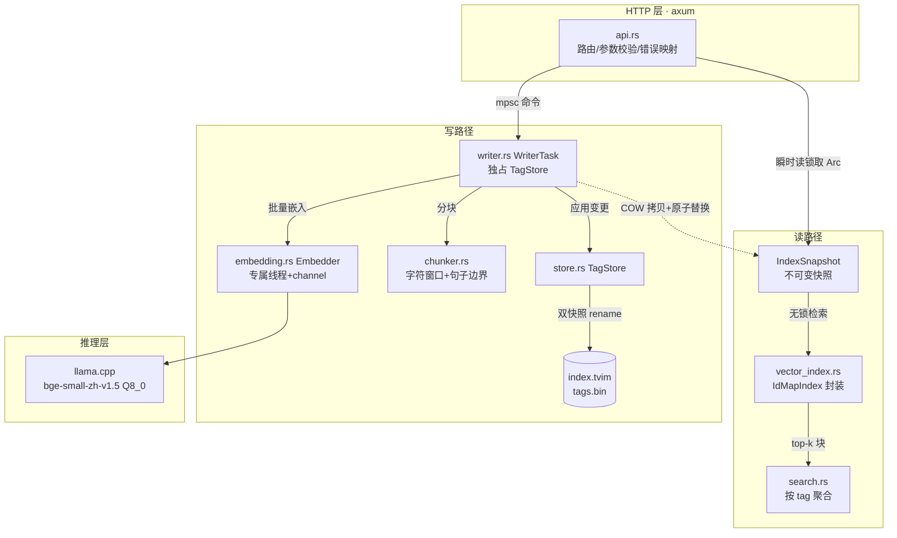

# 项目架构

> 本文档描述**当前实现**（v1.0.0）的架构。

## 1. 系统定位与边界

JuanNiang-RAG-Service 是 **tag（uuid）↔ 向量** 的存储与检索服务，供主 Agent 通过 HTTP 调用。

```
┌──────────────┐   tag + 全文     ┌────────────────────┐
│   主 Agent    │ ───────────────▶ │  JuanNiang-RAG-Service │
│（保管文档与   │   tag 列表 + 分数 │   （本仓库）        │
│  uuid）       │ ◀─────────────── │                    │
└──────────────┘                  └────────────────────┘
```

**契约**：Agent 端文本永不拆分；长文分块只发生在服务端内部，对外始终是 tag ↔ 全文。

## 2. 组件架构



| 组件 | 文件 | 职责 |
|---|---|---|
| 入口 | `main.rs` | 配置 → 存储加载 → 写者 → HTTP |
| 配置 | `config.rs` | 全部环境变量注入，带默认值 |
| 推理 | `embedding.rs` | 专属线程持有 `LlamaModel+LlamaContext`，channel 收发请求；批量打包、截断、归一化、预热、降级模式 |
| 分块 | `chunker.rs` | 字符窗口 + 句子边界回退 + 重叠（纯函数） |
| 索引 | `vector_index.rs` | `IdMapIndex` 封装：检索（按相似度降序）、删除、COW 序列化往返拷贝 |
| 存储 | `store.rs` | `TagStore`（写者独占）：tag↔块 1:N、双快照原子持久化、损坏自愈重建 |
| 写者 | `writer.rs` | 写队列 + COW 快照发布（读写互不阻塞）、批量合并发布 |
| 聚合 | `search.rs` | 块级命中按 tag 聚合（每 tag 取最高分）、分数映射、过滤排序 |
| API | `api.rs` | axum 路由、请求校验、查询 LRU 缓存、错误 → HTTP 映射 |

## 3. 核心机制

### 3.1 读写互不阻塞（快照发布）

- 读者：`RwLock<Arc<IndexSnapshot>>` **瞬时读锁**取 Arc 引用，之后检索/聚合全程无锁
- 写者：单任务独占 `TagStore`，改完执行 `commit()` = **持久化 → COW 拷贝 → 原子替换引用**
- `IdMapIndex` 没有 `Clone`，COW 用 **write→load 序列化往返**（10 万规模 ~54ms/次，按批量摊销）

### 3.2 推理专属线程

`LlamaContext` 是 `!Send`，无法跨任务共享 → 专属 OS 线程独占模型与 context，通过 `std mpsc`（请求）+ `tokio oneshot`（应答）通信。模型加载失败时线程进入**降级模式**（`/info` 上报失败原因，写入请求回错误）而非静默退出。

### 3.3 双快照持久化（零 SQL）

```
data/
  index.tvim   # IdMapIndex 产物：压缩向量 + u64 块 id 映射
  tags.bin     # bincode：tag→块 id 映射 + next_id + 原始归一化向量
```

- 原子写：临时文件 + `rename`；崩溃最多丢最后一次未返回的写入
- 自愈：启动时 `index.len() != 块数总和` → 用 tags.bin 原始向量全量重建索引
- 持久化**先于**发布：读者永远看不到未落盘的数据

### 3.4 批量合并发布

写者任务每次取队列时用 `try_recv` 把积压命令一并取出；批量 upsert 整批一次嵌入、一次持久化、一次发布（COW 成本按批摊销）。

## 4. 数据模型

```rust
type Tag = Uuid;                       // Agent 侧文档标识
TagStore {                             // 写者独占
    index: VectorIndex,                // u64 块 id ↔ 压缩向量
    tag_to_ids: HashMap<Uuid, Vec<u64>>, // tag → 块 id 列表（1:N）
    next_id: u64,                      // 单调递增，不复用
    raw_vectors: HashMap<u64, Vec<f32>>, // 原始向量（自愈重建用，可配置关闭）
}
IndexSnapshot {                        // 读者持有的不可变快照（COW）
    index: VectorIndex,
    tag_to_ids: HashMap<Uuid, Vec<u64>>,
    chunk_owner: HashMap<u64, Uuid>,   // 块 id → tag（聚合用，启动时反查构建）
    next_id: u64,
}
```

- 短文本（≤512 token）：1 个块；长文服务端分块（256 token/块、50 重叠）后挂多个块
- 覆写 = 删除 tag 全部旧块 → 分配新块 id 写入
- 检索返回相似度 `score ∈ [0,1]`（底层相似度 `(raw+1)/2` 映射，实测相同文本 ≈ 0.99）

## 5. 关键流程

### 写入（PUT /tags/{tag}）

```
分块(chunker) → 批量嵌入(embedder, is_query=false) → store.upsert(删旧加新)
→ store.persist(双快照原子写) → store.snapshot(COW) → prepare() → 替换 Arc → 应答
```

### 查询（GET /tags/search）

```
LRU 缓存命中？否 → 嵌入(embedder, is_query=true 加指令前缀)
→ 读锁取 Arc<IndexSnapshot> → index.search(top-k×3 块)
→ aggregate(按 tag 取最高分, min_score 过滤, 排序截取 k) → JSON
```

### 删除（DELETE /tags/{tag}）

```
store.delete(逐块 remove + 移除映射) → persist → snapshot → 替换 Arc → 应答
```

## 6. 关键技术决策记录

| 决策 | 原因 |
|---|---|
| 专属线程而非 Mutex 共享 context | `LlamaContext` 是 `!Send`（实测发现，推翻了早期设计草案的 Mutex 方案） |
| 零 SQL：双文件快照 | `IdMapIndex` 自带 `.tvim` 持久化；文本不存（Agent 端有全文），tags.bin 只存映射+原始向量 |
| 字符数近似 token 数分块 | 中文 BERT 分词 ≈ 1 字 1 token，避免引入 tiktoken 及其与 BERT 分词不一致 |
| COW 用序列化往返 | `IdMapIndex` 未实现 `Clone` |
| 持久化先于发布 | 读者永远不见未落盘数据，崩溃一致性清晰 |
| `n_ubatch=2048` | llama.cpp encoder 断言 `n_ubatch >= n_tokens`，且 `n_seq_max=16` 会把 `n_ctx` 向上取整到 4096（截断必须用模型原生长度而非 `ctx.n_ctx()`） |
| 分数语义 | turbovec 返回相似度而非距离（实测相同向量 0.997），排序/映射按此实现 |

## 7. 性能特性（实测，8 核 CPU + OpenBLAS）

| 指标 | 数值 |
|---|---|
| 查询端到端（100–200 字） | ~35–50 ms |
| 30 万向量检索 top-10 | 7.7 ms |
| COW 发布（30 万向量） | 53.6 ms/次 |
| 长文入库（5000 字 ≈ 20 块） | ~0.9 s |
| 空库启动内存 | ~79 MB RSS |
| 吞吐 | 查询嵌入串行 ~8–15 QPS（检索无锁并发） |

## 8. 已知限制

1. **内存随库线性增长**：原始向量常驻（10 万 tag ≈ 800 MB–1 GB）；`RAG_STORE_RAW_VECTORS=false` 可省 ~600 MB，代价是 `.tvim` 损坏后无法自愈
2. **tag 粒度 = 整篇文档**：引用定位需 Agent 在自有文档完成
3. **`n_ctx` 向上取整至 4096**（`n_seq_max=16` 副作用），多占 ~60 MB
4. **单机单进程**：不适合多实例横向扩展
5. **单块 >512 token 截断**：超长单段丢尾部（响应带 `truncated` 标记）

## 9. 相关文档

- [API.md](./API.md)：HTTP 接口规范（含 OpenAPI：`../api/openapi.yaml`）
- [development.md](./development.md)：开发环境、命令、规范
- [deployment.md](./deployment.md)：部署、运维、故障排查
- [CHANGELOG](../changelog/)：变更日志（每版本一个文件）
