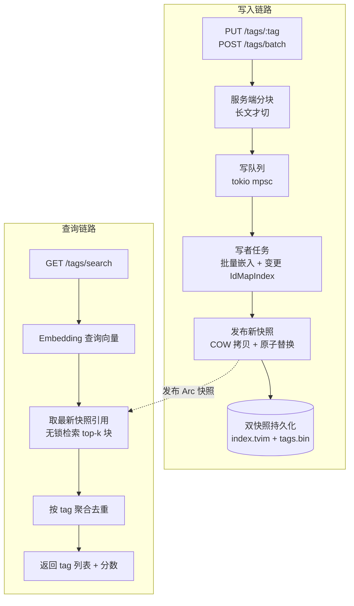

# JuanNiang-RAG-Service 技术文档（v3：Tag↔向量 检索服务）

> Rust + bge-small-zh-v1.5-q8（进程内推理）+ turbovec 的 **tag↔向量 检索服务**。
> 原始文档与 uuid 由主 Agent 保管，本服务只做向量化与检索，Agent 端文本零拆分、零改动。

## 1. 项目目标

- Agent 以 **tag（uuid）+ 全文** 调本服务 upsert；本服务以文本查询返回 tag 列表
- **长文本处理在服务端内部透明完成**（分块只发生在服务端，Agent 契约始终是"tag ↔ 全文"）
- 查询与写入互不阻塞（索引访问无锁化）
- 批量写入优化（批量推理 + 合并发布）

### 核心契约（对外）

| 操作 | 输入 | 语义 |
|---|---|---|
| 更新（upsert） | tag(uuid) + 全文 | tag 已存在 → 覆写其全部向量；不存在 → 新建 |
| 查询 | 文本 | 返回按相似度排序的 tag 列表（含分数），tag 去重 |
| 删除 | tag(uuid) | 删除该 tag 及其全部向量 |
| 批量写入 | `[{tag, text}, ...]` | 批量 upsert，批量推理 + 单次发布 |

**服务端内部是 1:N（tag ↔ 多个块向量），对外永远是 1:1（tag ↔ 全文）。**

## 2. 长文本策略：服务端透明分块

- 文本 ≤512 token（bge 上限）：**单向量**，零额外开销
- 文本 >512 token：服务端内部切块（**256 token / 块，重叠 50**），每块一个向量，全部挂到同一 tag 下
- 查询端：查询文本按 512 截断兜底（查询通常为 100–200 字，不受影响）
- Agent 无感知：无论长文短文，契约不变

### 检索聚合

```
查询向量 → 检索 top-k 块（k = k_tags × 3，兜底 100）
→ 按 chunk_owner 把块归并到 tag
→ 每 tag 取最高分（默认；可选 top-3 分数和）
→ 按分数排序，取前 k_tags 个 tag 返回
```

- `chunk_owner`（块 id → tag）不持久化，启动时从 `tag_to_ids` 反查构建（内存 ~12MB @ 30 万块）
- 聚合是 O(块数) 的 HashMap 操作，微秒级

## 3. 架构总览



## 4. 数据模型

```rust
type Tag = Uuid;   // Agent 侧文档标识

/// 写者独占的可变状态
struct TagStore {
    index: IdMapIndex,                    // 块级向量：u64 块 id ↔ 压缩向量
    tag_to_ids: HashMap<Tag, Vec<u64>>,   // tag → 块 id 列表（持久化）
    next_id: u64,                         // 单调递增，不复用
}

/// 发布给读者的不可变快照（COW 拷贝，见 §6.3）
struct IndexSnapshot {
    index: IdMapIndex,
    tag_to_ids: HashMap<Tag, Vec<u64>>,
    chunk_owner: HashMap<u64, Tag>,       // 启动时反查构建，聚合用
    next_id: u64,
}
```

- 覆写 = 删除该 tag 全部旧块 id → 分块 → 批量 `add_with_ids` 新块 id
- 删除 = 逐块 `remove(id)` → 移除 tag 条目
- `next_id` 单调递增，删除后 id 不复用

## 5. 存储设计（零 SQL 双快照）

```
data/
  index.tvim    # IdMapIndex::write 产物：压缩向量 + u64 块 id 映射（真源①）
  tags.bin      # bincode：tag_to_ids + next_id + 原始归一化向量（真源②）
```

- 原子快照：临时文件 + rename，崩溃最多丢最后一次发布
- tags.bin 存原始向量（2KB/块）用于 `.tvim` 损坏时重建；**长文多时体积 2–3 倍**（10 万 tag ≈ 400–650MB），可配置 `store_raw_vectors = false`（此时重建需 Agent 重推全文——Agent 端存有全部文本）
- 启动校验：`index.len() == tag_to_ids 块数总和`，不一致则重建

## 6. 并发模型（查询与写入互不阻塞）

### 6.1 角色

| 角色 | 状态所有权 | 锁 |
|---|---|---|
| 读者（HTTP 查询） | 只读 `Arc<IndexSnapshot>` | 取引用时瞬时读锁（纳秒级），检索/聚合**无锁** |
| 写者任务（单线程） | 独占 working `TagStore` | 无锁 |
| 发布 | 写者 → 读者 | 换引用（纳秒级） |

### 6.2 写队列

- 所有写请求进 `tokio mpsc`，写者任务顺序消费；批量写整批应用后**只发布一次**
- 单条写：应用后立即发布（read-your-writes）
- ack：应用后 ack（低延迟）；可配置改为发布后 ack（严格可见性）
- 高频单条写可开合并窗口（50ms 内合并发布，摊薄 COW 成本）

### 6.3 COW 发布

`IdMapIndex` 无 `Clone`，用序列化往返拷贝：`write(临时文件) → load → Arc 发布`。

- 成本 ≈ 10–80ms @ 10 万 tag（随规模线性），按批量摊销
- 发布后调 `prepare()` 预热检索缓存
- 读者持旧 Arc 照常检索，写者替换引用后旧快照由 Arc 安全释放

### 6.4 推理资源（唯一共享串行点）

- 查询嵌入与写者批量嵌入共用 llama context（`Mutex`）
- 写者批量嵌入按 ≤16 条/片分片、片间让锁，避免长批量拖垮查询
- 可选：读写各一个 context（内存 +30MB）彻底隔离

## 7. 批量写入优化

1. **批量推理**：llama.cpp 一次 forward 处理多段文本，吞吐 1.5–3×（长文分块后块数更多，收益更大）
2. **队列合并发布**：整批只做一次 COW + 一次双快照持久化
3. **批量 add**：`add_with_ids` 本身就是 batch 接口

## 8. 推理加速（第一梯队：零/低投入）

推理占查询端到端延迟的 90%（40–120ms），以下优化只需改配置/加缓存，代码量小、无新硬件：

### 8.1 线程数调优

- 小模型推理常受线程调度开销拖累，**并非线程越多越快**
- 8 核 CPU 上实测 2/4/6/8 线程，通常 4–6 为最优（批量推理时线程利用率更高）
- 线程数作为配置项（`n_threads`），阶段 0 基准中做扫描后固化

### 8.2 固定 n_ctx = 512

- 按 bge 上下文上限配置 context（而非最大安全值），减少 KV cache 内存与初始化开销
- 写入侧长文分块后单块 ≤512 token，不存在截断

### 8.3 查询 embedding LRU 缓存

- 高频相似查询（Agent 反复问同类问题）命中后直接返回，零推理
- 实现：`lru` crate，key = 查询文本，value = 归一化向量
- 默认 1024 条（~2MB），命中率不足时调大
- **只缓存查询，不缓存写入**（写入侧用 §8.4）

### 8.4 文本 hash 去重（写入侧 memoization）

- 批量写入内按文本 hash 去重，相同文本只嵌入一次
- 跨请求短期缓存（如 5 分钟）可进一步吸收 Agent 重复推送
- 只对"嵌入结果"缓存，向量本身仍按 tag 正常写入

### 8.5 启动预热

- 启动时执行一次短嵌入，跳过首个请求的懒初始化（旋转矩阵/码本/布局缓存）
- 与 turbovec `prepare()` 同理，预热应在后台完成，不阻塞 HTTP 监听

### 8.6 收益与边界

| 手段 | 效果 |
|---|---|
| 线程调优 | ±20–30%（可能双向，需实测） |
| n_ctx=512 | 内存与初始化开销减少 |
| LRU 缓存 | 命中即 ~0ms 推理 |
| 写入去重 | 重复文本写入提速 N 倍 |
| 预热 | 首请求延迟归零 |

**边界**：本梯队优化的是吞吐与命中场景；单条冷查询的延迟上限仍由推理本身决定。吞吐不够 → 多 context 池 / 查询 batch 合并（第二梯队）；延迟硬指标 → GPU（第三梯队，单条 5–15ms）。两者作为后续升级路径，不在本期范围。

## 9. 关键实现细节

- `llama-cpp-2` 加载 Q8_0 GGUF（~30MB），`embedding = true`
- 查询加指令前缀 `为这个句子生成表示以用于检索相关文章：`；入库文本不加
- 插入/查询前 L2 归一化；拒绝 NaN / 非有限值
- `IdMapIndex::new(512, 4)`（bit_width ∈ {2,3,4} 取 4）
- 分块用 text-splitter（256 token / 50 overlap），仅服务端内部使用
- 长文单篇块数上限（防滥用，建议 2000 块/篇，可配置）

## 10. 性能预算

前提：8 核中端 CPU（AVX2）、SSD、无 GPU、10 万 tag、文本 100–200 字（长文混入后平均 2–3 块/tag）。

| 环节 | 耗时 |
|---|---|
| 查询嵌入（100–200 字） | 40–120 ms |
| 检索（25–30 万块向量穷举） | 3–10 ms |
| 按 tag 聚合 + 序列化 | <1 ms |
| **查询端到端** | **≈ 50–130 ms，写操作不阻塞查询** |
| 单条短文写：嵌入 + 发布 | 40–120 ms + 10–80 ms |
| 单条长文写（5000 字 ≈ 20 块）：嵌入 + 发布 | 2–6 s + 10–80 ms |
| 批量 100 篇长文 | 嵌入批量摊销 + 单次发布 |
| 启动加载 | 0.5–1.5 s |
| 常驻内存 | ~150–200 MB（模型 30MB + 索引 ~65MB + 映射） |
| 磁盘 | index.tvim ~65MB + tags.bin 400–650MB（含原始向量） |

吞吐：查询嵌入串行约 8–15 QPS；检索无锁并发不构成瓶颈。

## 11. 长文本备选方案对比

| 方案 | 优点 | 缺点 |
|---|---|---|
| **A. 服务端透明分块（本方案）** | Agent 契约不变；小模型速度快 | 向量量 2–3×；tag 粒度 = 整篇 |
| B. 换 bge-m3（8192 上下文，1024 维） | 免分块，覆盖绝大多数长文，支持稀疏/多向量 | 模型 ~570MB、CPU 慢 10×+、索引内存翻倍 |
| C. 截断 512 | 零成本 | 长文本信息丢失 |
| D. Agent 端分块多 uuid | 检索粒度细 | 违反"Agent 端不拆分"约束 |

## 12. 项目结构

```
src/
  main.rs          # 启动、配置、初始化（模型 + 索引 + 写者任务）
  config.rs        # 模型路径、数据目录、端口、分块参数、n_threads、LRU 容量、合并窗口
  embedding.rs     # Embedder：llama-cpp-2 封装、前缀、归一化、批量推理
  chunker.rs       # 服务端内部分块（256/50，仅长文触发）
  vector_index.rs  # IdMapIndex 封装：add/remove/search/COW 拷贝/重建
  store.rs         # TagStore：tag_to_ids、working 状态、双快照、加载
  writer.rs        # 写者任务：消费队列、批量嵌入、发布快照
  api.rs           # axum 路由
  search.rs        # 查询流水线：嵌入 → 检索 → 按 tag 聚合 → 返回
```

## 13. 依赖清单

```toml
[dependencies]
turbovec = "0.9"          # 向量索引（IdMapIndex）
llama-cpp-2 = "0.1"       # 进程内 GGUF 推理
axum = "0.8"              # HTTP API
tokio = { version = "1", features = ["full"] }
serde = { version = "1", features = ["derive"] }
serde_json = "1"
bincode = "1"             # tags.bin 序列化
text-splitter = "0.19"    # 服务端内部分块
lru = "0.12"              # 查询 embedding 缓存（§8.3）
uuid = { version = "1", features = ["v4"] }
thiserror = "2"
tracing = "0.1"
tracing-subscriber = "0.3"
```

## 14. API 草案

| 方法 | 路径 | 说明 |
|---|---|---|
| PUT | `/tags/{tag}` | upsert：body `{ "text": "..." }`；长文服务端自动分块。响应含 `{ chunk_count }` |
| POST | `/tags/batch` | 批量 upsert：body `[{ "tag": "<uuid>", "text": "..." }]` |
| GET | `/tags/search?q=&k=&min_score=` | 检索：`q` 文本，`k` 条数（默认 10），`min_score` 下限。返回 `{ "results": [{ "tag": "<uuid>", "score": 0.87 }] }`（tag 去重聚合后） |
| DELETE | `/tags/{tag}` | 删除 tag 及其全部向量 |
| GET | `/health` | 健康检查 + tag 数 + 块向量数 + 快照版本 |

## 15. 模型与数据文件

| 文件 | 说明 |
|---|---|
| `models/bge-small-zh-v1.5-q8_0.gguf` | Q8_0 GGUF（~30MB） |
| `data/index.tvim` | IdMapIndex 产物（块级压缩向量 + u64 id 映射） |
| `data/tags.bin` | tag_to_ids + next_id + 原始归一化向量（重建用） |
